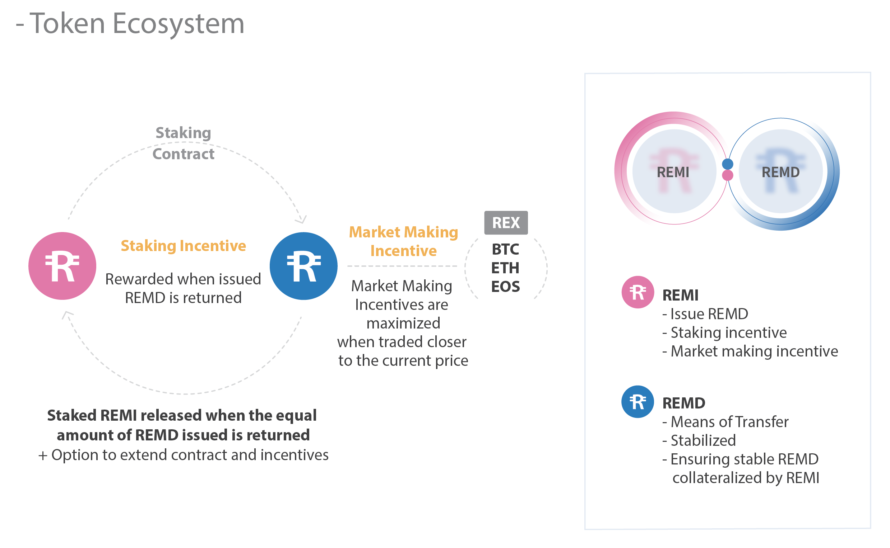

# REMI
REMI(RMI) is a REMIIT project external token based on ERC20
## Solidity compiler
- build Version : 0.4.24+commit.e67f0147.Emscripten.clang

## Truffle 
- Version : v4.1.14 (core: 4.1.14)

## Token Economy

🎉 REMIIT 프로젝트는 송금 비즈니스와 유기적으로 설계된 자체 안정화 토큰 시스템을 가지고 있습니다.
안정화시키기 위한 가장 핵심적인 요소는 토큰의 REMI-REMD 이중화입니다. 
REMI는 외부거래소에서 거래될 수 있는 ERC20 기반 토큰이며, REMD는 내부 비즈니스용으로만 사용될 수 있습니다.
REMD는 Ethereum side-chain 으로서 Ethereum의 EVM 과 Tendermint 합의알고리즘을 이용한 Ethermint를 사용해 개발될 예정입니다.
DEX의 기능을 효과적으로 수행하기고 자체적인 성능과 거버넌스를 갖기위해 사이드체인으로 개발되며, 텐더민트를 채택함으로서 인터체인의 기능을 넓혀갈 것입니다.
토큰 이코노미에 대한 설명은 토큰 백서를 참고하시기 바랍니다.
- [Eng](https://s3-ap-northeast-1.amazonaws.com/remiiit-docu/Papers/tokenEconomy_eng.pdf)
- [한글](https://s3-ap-northeast-1.amazonaws.com/remiiit-docu/Papers/tokenEconomy_kor.pdf)
 
### REMIIT REMI
- 일반적인 ERC20 기반 토큰
- 어드민 기능
  - 어드민 기능 잠금/해제
  - 전체 전송 잠금/해제
  - 전체 전송 자금시 화이트리스트 관리
  - 전체 전송 해제시 블랙리스트 관리
  - 토큰소각 가능
  - 위험상황에서 지갑토큰 회수 기능  

## Dependencies
We use Truffle in order to compile and test the contracts.

It can be installed:
`npm install -g truffle`

For more information visit https://truffle.readthedocs.io/en/latest/

Also running node with active json-rpc is required. For testing puproses we suggest using https://github.com/ethereumjs/testrpc

## Usage
- `truffle compile` - compile all contracts
- `truffle test` - run tests

